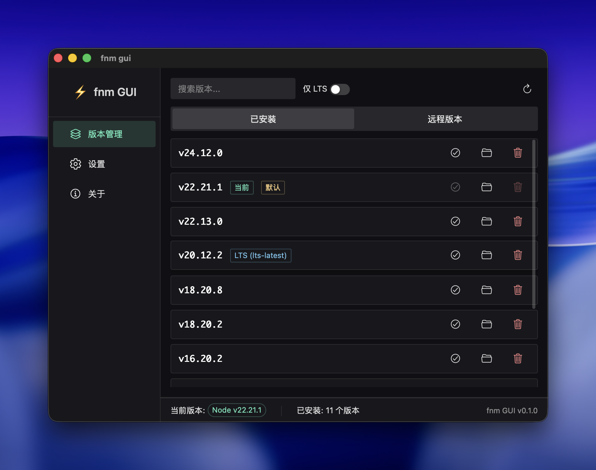

# fnm GUI Client

<p align="center">
  <span style="font-size: 64px;">⚡</span>
</p>

<p align="center">
  <strong>一个基于 Tauri + Vue 3 的 fnm 图形界面客户端</strong>
</p>

<p align="center">
  <a href="#功能特性">功能特性</a> •
  <a href="#截图预览">截图预览</a> •
  <a href="#安装">安装</a> •
  <a href="#使用说明">使用说明</a> •
  <a href="#开发">开发</a> •
  <a href="#构建">构建</a>
</p>

---

## 功能特性

- 🚀 **快速版本管理** - 一键安装、卸载、切换 Node.js 版本
- 📦 **版本浏览** - 查看已安装和远程可用的所有 Node.js 版本
- 🔍 **智能搜索** - 支持版本号关键字搜索和 LTS 筛选
- 🌐 **镜像源配置** - 提供国内常用镜像源配置指引（淘宝、腾讯、华为）
- 📂 **目录管理** - 快速打开 fnm 安装目录和版本目录
- 🎨 **现代化界面** - 暗色主题，流畅动画，美观易用
- 💻 **跨平台支持** - 支持 macOS、Windows、Linux

## 截图预览



## 前置要求

在使用 fnm GUI 之前，请确保你已经安装了 **fnm (Fast Node Manager)**：

### macOS

```bash
# 使用 Homebrew
brew install fnm

# 或使用官方安装脚本
curl -fsSL https://fnm.vercel.app/install | bash
```

### Windows

```bash
# 使用 winget
winget install Schniz.fnm

# 或使用 Scoop
scoop install fnm

# 或使用 Chocolatey
choco install fnm
```

### Linux

```bash
# 使用官方安装脚本
curl -fsSL https://fnm.vercel.app/install | bash
```

安装完成后，请按照 [fnm 官方文档](https://github.com/Schniz/fnm#shell-setup) 配置你的 shell 环境。

## 安装

### 下载预编译版本

前往 [Releases](https://github.com/lifedever/fnm-client/releases) 页面下载适合你系统的安装包：

- **macOS**: `fnm-client_x.x.x_aarch64.dmg` (Apple Silicon) 或 `fnm-client_x.x.x_x64.dmg` (Intel)
- **Windows**: `fnm-client_x.x.x_x64-setup.exe`
- **Linux**: `fnm-client_x.x.x_amd64.deb` 或 `.AppImage`

### 从源码构建

请参考下方 [构建](#构建) 章节。

## 使用说明

### 版本管理

1. **查看已安装版本**：在"已安装"标签页中查看所有已安装的 Node.js 版本
2. **安装新版本**：切换到"远程版本"标签页，点击"安装"按钮
3. **卸载版本**：在已安装列表中，点击卸载图标（当前使用中的版本无法卸载）
4. **设为默认版本**：点击版本条目上的勾选图标将其设为默认版本
5. **打开安装目录**：点击文件夹图标打开该版本的安装目录

### 搜索与筛选

- 使用搜索框输入版本号关键字进行筛选
- 开启"仅 LTS"开关仅显示长期支持版本

### 设置

- 查看当前 fnm 配置信息（安装目录、系统架构、版本文件策略等）
- 获取镜像源配置命令（国内用户建议使用淘宝或腾讯镜像）

## 开发

### 技术栈

- **前端**: Vue 3 + TypeScript + Naive UI
- **后端**: Rust + Tauri 2.0
- **状态管理**: Pinia
- **包管理**: pnpm

### 环境要求

- Node.js 18+
- Rust 1.70+
- pnpm 8+

### 本地开发

```bash
# 克隆项目
git clone https://github.com/lifedever/fnm-client.git
cd fnm-client

# 安装依赖
pnpm install

# 启动开发服务器
pnpm tauri dev
```

### 项目结构

```
fnm-client/
├── src/                    # Vue 前端源码
│   ├── components/         # Vue 组件
│   ├── stores/             # Pinia 状态管理
│   ├── types/              # TypeScript 类型定义
│   └── utils/              # 工具函数
├── src-tauri/              # Rust 后端源码
│   ├── src/
│   │   ├── commands/       # Tauri 命令
│   │   │   ├── common.rs   # 通用工具函数
│   │   │   ├── version.rs  # 版本管理命令
│   │   │   ├── env.rs      # 环境配置命令
│   │   │   └── fs.rs       # 文件系统命令
│   │   ├── lib.rs          # 库入口
│   │   └── main.rs         # 程序入口
│   └── tauri.conf.json     # Tauri 配置
└── package.json
```

## 构建

### 构建生产版本

```bash
# 构建适用于当前平台的安装包
pnpm tauri build
```

构建产物位于 `src-tauri/target/release/bundle/` 目录。

### 跨平台构建

使用项目提供的构建脚本可以同时构建多个平台：

```bash
# 查看构建脚本帮助
./build.sh --help

# 构建所有平台
./build.sh --all
```

## 常见问题

### 应用无法找到 fnm

确保 fnm 已正确安装并配置到系统 PATH 中。应用会在以下路径查找 fnm：

**macOS**:

- `/opt/homebrew/bin/fnm` (Apple Silicon Homebrew)
- `/usr/local/bin/fnm` (Intel Homebrew)
- `~/.cargo/bin/fnm` (Cargo 安装)
- `~/.fnm/fnm` (官方脚本安装)
- `~/.local/bin/fnm`

**Windows**:

- `%LOCALAPPDATA%\fnm\fnm.exe`
- `%USERPROFILE%\.cargo\bin\fnm.exe`
- `%USERPROFILE%\scoop\shims\fnm.exe`

**Linux**:

- `/usr/bin/fnm`
- `/usr/local/bin/fnm`
- `~/.cargo/bin/fnm`
- `~/.fnm/fnm`
- `~/.local/bin/fnm`

### 列表为空或设置无法加载

这通常是因为应用无法找到 fnm 命令。请检查：

1. fnm 是否已正确安装：在终端运行 `which fnm` (macOS/Linux) 或 `where fnm` (Windows)
2. 如果 fnm 安装在非标准路径，请确保该路径在应用支持的路径列表中

## 许可证

MIT License © 2025 [lifedever](https://github.com/lifedever)

## 致谢

- [fnm](https://github.com/Schniz/fnm) - Fast and simple Node.js version manager
- [Tauri](https://tauri.app/) - Build smaller, faster, and more secure desktop apps
- [Vue.js](https://vuejs.org/) - The Progressive JavaScript Framework
- [Naive UI](https://www.naiveui.com/) - A Vue 3 Component Library
